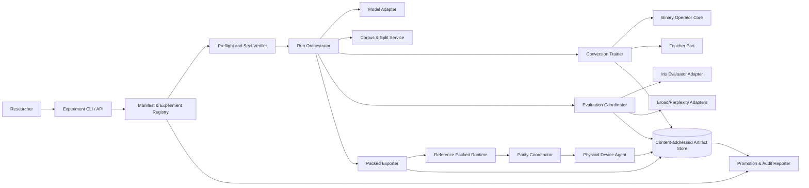
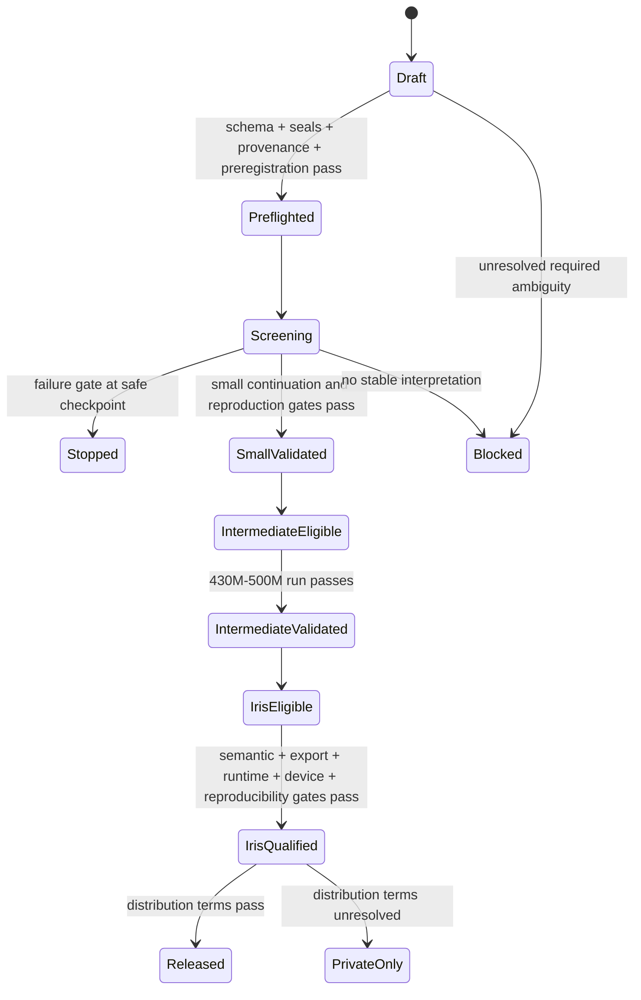
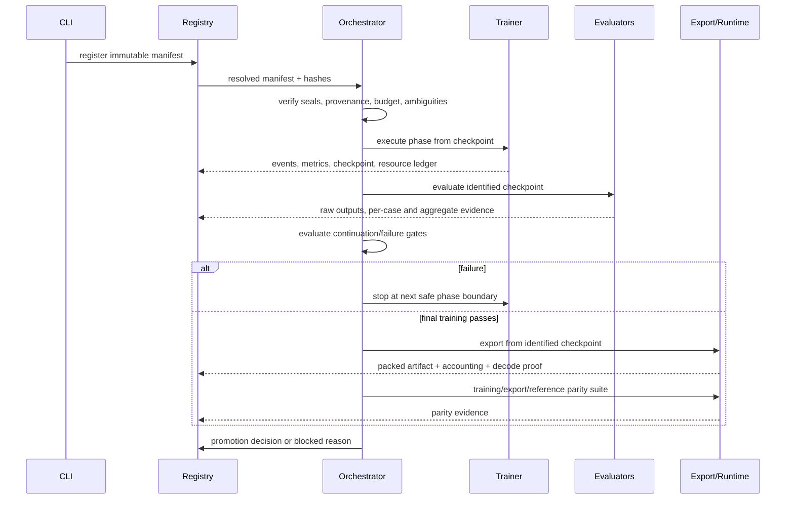

# Design Document: Binary LLM Conversion Framework

## Overview

The Binary LLM Conversion Framework is an auditable research system for converting selected transformer linear weights from a sealed dense checkpoint into a directly executable packed binary representation. Its first goal is not to claim that BinaryLLM works for Iris; it is to reproduce the paper-derived regime at 70M–135M scale, identify which claims survive controlled reproduction, and permit promotion through 430M–500M only before attempting MiniCPM5/Iris 1.081B. A candidate is releasable only when semantic, safety, provenance, artifact, packed-runtime, reproducibility, and physical-device gates all pass.

The design separates four concerns:

1. **Scientific truth:** source claims, framework choices, ambiguity resolutions, hypotheses, ablations, and observed evidence are distinct versioned records.
2. **Conversion math:** binary-aware initialization, consistent progressive training, exact derivatives, dual scaling, sign substitution, and packing have small explicit interfaces suitable for differential and property testing.
3. **Experiment execution:** immutable manifests, sealed inputs, staged budgets, checkpoint boundaries, gates, and append-only evidence make runs reproducible and interruptible.
4. **Qualification:** existing Iris generation/scoring, broad evaluation, exact artifact accounting, packed-runtime parity, and device agents consume identified artifacts without changing conversion state.

### Goals

- Faithfully reproduce the supplied BinaryLLM algorithm before introducing Iris-specific recovery.
- Make every material paper ambiguity visible, versioned, testable, and promotion-blocking until resolved for the affected scale.
- Minimize wasted compute through screening runs and monotonic scale promotion.
- Preserve broad capability and exact Iris tool/safety behavior with target-native recovery and teacher guidance.
- Produce an honest packed-bit artifact whose direct runtime agrees with the training operator.
- Reuse Iris dataset normalization, templates, sealed model verification, run identity, and deterministic evaluator through clean adapters.

### Non-goals

- Production training or mobile-kernel implementation in this phase.
- Treating paper results as reproduced evidence without local runs.
- Calling container compression, sparse zeros without sparse kernels, or transient dense expansion “one-bit inference.”
- Combining binary, ternary, pruning, or distillation results under one method label.
- Silently selecting an underspecified optimizer, precision, scale transform, fold rule, or export convention.

### Research basis and design consequences
The design is grounded in the supplied [BinaryLLM implementation notes](../../../docs/research-papers/2508.06974v2-binaryLLM-implementation-notes.md), the local [paper conversion](../../../docs/research-papers/2508.06974v2-binaryLLM.md), and the [Iris extreme-compression research record](../../../docs/research-papers/iris-extreme-compression-research-2026-07-16.md). The primary external source is [Rethinking 1-bit Optimization Leveraging Pre-trained Large Language Models](https://arxiv.org/abs/2508.06974). The local reconstruction found no official BinaryLLM implementation, so equations are source claims but implementation choices are not presumed.

The findings that determine this design are:

- The paper binarizes attention Q/K/V/output and FFN linears, while activations, embeddings, LM head, normalization, and biases remain excluded. Whole-artifact accounting must therefore be independent of the paper’s transformer-linear bit rate.
- Stage 1 freezes dense weights and jointly optimizes one input-channel scale per linear for 50 steps under autoregressive loss, but positivity, zero avoidance, inverse activation handling, and the transition into Stage 2 are underspecified.
- Stage 2 uses `F(x,t)=tanh(t*x)/tanh(t)` and its analytical derivative, 20 data phases, an exponential schedule, and analytical plus learned row scales. The phase-index convention is material because the formula gives `t=0` at `c=0`.
- The reported 135M and 70M experiments still lose substantial quality; BinaryLLM is a hypothesis, not a release recipe.
- MiniCPM5/Iris has 1,080,632,832 parameters and unusually large untied embedding/head matrices. A binary body with BF16 excluded tensors cannot meet the deployment target; Q4/Q8/reduced-vocabulary variants must be separate candidates with exact accounting.
- Existing Iris BF16 and Q4 results show that low nominal precision can preserve syntax while losing semantics, math, or code. Promotion therefore uses per-slice gates and paired failures, never loss or one aggregate score alone.
- A deployment claim requires direct packed execution and physical-device measurements; theoretical operation counts and compressed files are not runtime evidence.

Content derived from the external paper is paraphrased; equations and reported values must be checked against the preserved source version during reproduction.

## Architecture

### Architectural principles

1. **Manifests are the control plane.** No run starts from ad hoc CLI defaults. A validated, content-addressed `ExperimentManifest` fully resolves inputs, algorithm choices, budgets, gates, and tolerances.
2. **Evidence is append-only.** Runs emit immutable events and artifacts. Corrections create superseding records; they do not rewrite observed results.
3. **Pure core, impure shell.** Quantization math, schedule generation, gate evaluation, byte accounting, bootstrap statistics, and pack/unpack are pure functions. GPU training, files, subprocesses, model generation, and device measurement sit behind ports.
4. **Fail closed.** Missing hashes, provenance, ambiguity decisions, metrics, runtime support, or exact byte reconciliation block promotion.
5. **Artifact-ladder identity.** Every metric names exactly one checkpoint or deployment artifact and its parent; metrics never flow sideways between rungs.
6. **Same representation during recovery.** Target binary operators remain active in all evaluated recovery forwards; recovery never trains dense and quantizes only at the end.
7. **Scale-aware progression.** Promotion is `small -> intermediate -> Iris`, and new operator choices return to a small screening run.

### System context



### Logical layers

| Layer | Responsibility | Must not do |
|---|---|---|
| Domain core | Operators, schedules, accounting, gates, statistics, state transitions | Read files, launch jobs, infer defaults |
| Ports | Typed contracts for model, trainer, teacher, evaluator, exporter, runtime, device | Embed a specific model architecture |
| Adapters | PyTorch/Transformers, Iris, lm-eval, packed reference, mobile agent | Alter domain decisions |
| Orchestration | Resolve manifests, verify seals, allocate budgets, checkpoint, stop, promote | Compute metrics differently per family |
| Registry/store | Immutable identities, events, manifests, evidence, hashes | Overwrite or relabel historical evidence |

### Scale ladder and promotion state machine

The minimal implementation supports two small adapters: Pythia-70M for cheap operator/dual-scale/ambiguity ablations and SmolLM-135M for the paper-compatible reference reproduction. A program may use either as its first executable target, but the BinaryLLM reference claim requires the registered 135M-compatible protocol unless an explicit source difference marks it “modified reproduction.” The intermediate rung is a declared 430M–500M pretrained dense model selected in its manifest; no model identity is hard-coded by the framework. The final rung is MiniCPM5/Iris at pinned revision `4e9de7a0778dc1c362e983e6858f0e77542cbdca` and 1,080,632,832 parameters.



Promotion eligibility is computed, never manually asserted. The promotion record references successful gate evidence, ambiguity-register version, exact method family, scale, and parent artifact. A new operator, fold rule, schedule, or ambiguity decision invalidates inherited eligibility and requires a small screening run.

### Experiment execution flow



### BinaryLLM reference algorithm

#### Tensor scope

A `ModelAdapter` enumerates parameters and assigns exactly one semantic role. For the reference family, `Binary_Body` includes attention query, key, value, output projections and every FFN linear projection (including gated/SwiGLU up, gate, and down projections). Embeddings, untied/tied LM head, normalization weights, biases, rotary tables, buffers, and adapter-declared exceptions are `Excluded_Tensors`. The scope inventory is frozen before training; an unclassified or multiply classified tensor is a preflight error.

#### Stage 1: binary-aware initialization

For each eligible dense matrix `W[out,in]`, Stage 1 creates an input scale vector `s[in]`, initialized to the manifest value (paper-reference value `1`). Dense model parameters are frozen and only scale parameters are optimizer-visible. The scaled latent weight is conceptually `W_tilde = W / s`, and each forward evaluates the manifest-selected binary-aware operator under end-to-end causal loss. The reference run has exactly 50 optimizer steps and reports train/held-out loss, reconstruction error, extrema, gradient statistics, and non-finite counts.

The paper does not settle how the inverse activation transform is retained/folded, nor how `s` stays positive and nonzero. Therefore Stage 1 has no unrecorded default. Initial ambiguity candidates include:

- `positive_exp`: `s=exp(u)` with `u=0` initially;
- `positive_softplus`: `s=softplus(u)+epsilon`, initialized to represent one;
- `signed_clamp`: unconstrained `s` with a registered magnitude floor (a modified operator, not reference-equivalent);
- `weight_only_transition`: use `W/s` as Stage-2 latent weights and discard the activation factor;
- `explicit_activation_transform`: retain `s*A` through a declared module/fold plan and prove dense-equivalence before binarization.

Each mathematically distinct interpretation receives matched data, initialization, budget, and seed comparisons. Non-finite values preserve the failing scale state and diagnostic batch before stopping.

#### Stage 2: consistent progressive training

For latent row `w`, analytical scale `a=mean(abs(w))`, learned row scale `l`, normalized latent `z=w/a`, and phase parameter `t`, the reference effective row is:

```text
F(z,t) = tanh(t*z) / tanh(t)
effective_weight = l * a * F(z,t)
dF/dz = t * (1 - tanh(t*z)^2) / tanh(t)
```

The implementation uses a custom autograd function whose backward is the analytical derivative, not an STE. For numerical stability it uses a registered small-`t` branch implementing the continuous limit `F(z,0)=z` and `dF/dz=1`; whether phase indexing reaches `t=0` remains an ambiguity tested as `c=0..19` versus `c=1..20`, not a silent choice. Stable tanh evaluation occurs in manifest-declared compute precision.

The broad stream is deterministically partitioned by semantic-family group and data-order seed into 20 non-overlapping token partitions. Partition hashes and token counts are frozen before phase 1. The paper schedule candidate is `t(c)=1.3*exp(0.22*c)-1.3`; at least one alternative schedule is matched on small scale. At each phase boundary the framework saves full resumable state and evaluates loss, perplexity, capability slices, analytical/learned/merged scale distributions, saturation, gradients, and sign-flip rate.

`a` is recomputed from current latent rows at every optimizer update. Whether gradients pass through `a` or use a detached analytical statistic is explicitly versioned in the ambiguity register because the paper does not fully define implementation semantics. `l` starts at one. The analytical-only, learned-only, and product variants are separate matched experiment arms. Any offset, exception tensor, or extra precision changes the representation identifier.

After phase 20, evaluators score both the progressive checkpoint and a sign-substituted view:

```text
merged_scale = l * a
inference_weight = merged_scale * sign(w)
```

The sign zero convention, scale storage precision, scale folding point, and rounding are export-semantics ambiguities. A sign candidate that fails a gate passed by the progressive view is not export-eligible.

#### Recovery and teacher guidance

Recovery is a separate stage that starts only after raw-candidate continuation floors pass. It retains the target binary forward operator on every training and evaluation forward. The initial token allocation is 30% broad text, 15% math, 10% code, 20% Iris tools, 10% conversation, 10% clarification/confirmation/denial/safety, and 5% adversarial data, plus a preregistered alternative mix.

`TeacherPort` supports:

- shared-tokenizer logit supervision (full or top-k with mass/coverage recorded),
- shared-tokenizer sequence supervision,
- different-tokenizer text-level sequence supervision evaluated by execution checks or registered blinded rubrics.

The sealed Iris BF16 baseline is always the behavioral teacher for exact tool protocol and safety decisions. A broad teacher is a separate identity with revision, terms, generation configuration, and per-record provenance. Runs without teachers are first-class controls. Calibration-only improvement without frozen capability improvement triggers no-progress stopping.

### Packed representation and reference execution

The versioned binary container is self-describing and deterministic. Each binary matrix stores row-major packed sign bits, one merged scale per output row, shape/stride metadata, semantic role, and checksums. Bit order, row padding, zero-sign rule, scale dtype/endianness, alignment, and container version are explicit. Excluded tensors use individually declared representations. No tensor inherits a representation from a filename or global label.

The exporter always consumes a training checkpoint, never another deployment artifact. It emits a tensor ledger before writing, writes deterministically, reopens the file, decodes every tensor, compares signs exactly and scales within preregistered tolerance, then reconciles ledger bytes with actual file bytes to zero discrepancy.

The reference runtime memory-maps or streams packed rows and computes signed accumulation directly from bits and activations, applying one row scale without creating a persistent dense weight tensor. Temporary tile-local expansion is permitted only if bounded and reported; whole-model persistent expansion fails the runtime gate. Instrumentation reports resident packed bytes and maximum temporary expansion.

Parity proceeds from the smallest unit outward: pack/unpack, binary linear outputs, selected layer outputs, final logits, greedy tokens, and exact Iris tool decisions. Numeric tolerances are preregistered; deterministic token and tool outputs require exact identity.

### Controls and family isolation

`MethodPlugin` is implemented independently for `binary`, `ternary`, `structured_pruning_q4`, `distilled_student_q4_or_qat`, and explicitly named hybrids. Plugins share sealing, data, evaluation, accounting, statistics, and device ports but cannot share family labels or representation claims. The required pruning control targets 430M–500M; the distilled control targets 270M–500M. Unsupported runtimes retain research evidence but are excluded from deployable Pareto sets.

## Components and Interfaces

Interfaces below are design contracts, not production code.

```python
class ModelAdapter(Protocol):
    def identity(self) -> ModelIdentity: ...
    def enumerate_tensors(self, model: object) -> list[TensorDescriptor]: ...
    def binary_body(self, tensors: list[TensorDescriptor]) -> BinaryScope: ...
    def replace_linears(self, model: object, factory: BinaryLinearFactory) -> object: ...
    def load_sealed(self, baseline: SealedBaselineRef) -> object: ...
    def render(self, conversation: object, tools: object | None) -> str: ...
```

Adapters exist for Pythia-70M, SmolLM-135M, a manifest-selected 430M–500M architecture, and MiniCPM5/Iris. Each adapter supplies architecture-specific module names and tied-weight facts; the core never matches names heuristically. The MiniCPM adapter pins model/tokenizer revision and templates and explicitly identifies the 1536-width, 130,560-vocabulary embedding and untied head.

```python
class BinaryOperator(Protocol):
    def initialize_scales(self, tensor: TensorView, choice: ScaleChoice) -> ScaleState: ...
    def progressive(self, latent: TensorView, t: float, scales: ScaleState) -> TensorView: ...
    def sign_view(self, latent: TensorView, scales: ScaleState, zero_rule: str) -> TensorView: ...
    def diagnostics(self) -> OperatorDiagnostics: ...

class ProgressionSchedule(Protocol):
    def parameters(self, phase_count: int) -> tuple[float, ...]: ...

class TrainerBackend(Protocol):
    def stage1(self, context: RunContext, model: object) -> CheckpointRef: ...
    def progressive_phase(self, context: RunContext, checkpoint: CheckpointRef, phase: Phase) -> CheckpointRef: ...
    def recover(self, context: RunContext, checkpoint: CheckpointRef, teacher: TeacherPort | None) -> CheckpointRef: ...
    def stop_at_safe_boundary(self, reason: GateDecision) -> CheckpointRef: ...
```

The PyTorch backend reuses existing Iris conventions: `IRIS_RUN_ID`/`IRIS_ATTEMPT_ID`, offline sealed model channels, full optimizer/checkpoint state, JSON events, and metric events. The conversion trainer is a distinct backend because current `iris_training.train` only supports dense LoRA/QLoRA/full training; it imports or delegates existing config validation, dataset normalization/rendering, preflight, and artifact hashing rather than altering those semantics.

```python
class CorpusService(Protocol):
    def freeze(self, records: Iterable[ProvenanceRecord], policy: SplitPolicy) -> CorpusManifest: ...
    def progressive_partitions(self, corpus: CorpusManifest, phases: int, seed: int) -> tuple[PartitionRef, ...]: ...
    def assert_isolated(self, corpus: CorpusManifest, frozen_eval: EvaluationSetRef) -> IsolationReport: ...

class TeacherPort(Protocol):
    def identity(self) -> TeacherIdentity: ...
    def supervise(self, batch: Batch, mode: SupervisionMode) -> TeacherBatch: ...
```

Data freezing groups source documents, paraphrases, synthetic siblings, and tool templates before deterministic split assignment. Exact and fuzzy dedup reports are artifacts. Records missing source, license/terms, or allowed use are rejected before hashing. Frozen benchmark and private semantic-family fingerprints are deny lists for calibration, recovery, and teacher generation.

```python
class Evaluator(Protocol):
    def protocol(self) -> EvaluationProtocol: ...
    def generate(self, candidate: ArtifactRef, cases: EvaluationSetRef) -> RawOutputRef: ...
    def score(self, outputs: RawOutputRef) -> EvaluationEvidence: ...
```

`IrisEvaluatorAdapter` reuses `scripts/run-eval.py` generation semantics and calls `iris_training.evaluate.evaluate_case`, `aggregate`, or `evaluate_files` for deterministic tool metrics. It does not repair outputs. The adapter extends case metadata and aggregation for macro/worst-route, denial, duplicate side effects, unauthorized access, privacy leakage, injection, and over-clarification while preserving the existing core metrics. Broad adapters cover held-out perplexity with identical tokenization/sequence protocol, lm-evaluation-harness panels, code execution in a sandbox, and blinded rubric panels. External and private Iris outputs remain separate evidence sets.

```python
class ExperimentRegistry(Protocol):
    def register(self, manifest: ExperimentManifest) -> ExperimentRef: ...
    def begin_attempt(self, experiment: ExperimentRef) -> AttemptRef: ...
    def append_event(self, attempt: AttemptRef, event: RunEvent) -> None: ...
    def attach(self, owner: object, artifact: ContentAddressedRef) -> None: ...
    def supersede(self, old: object, new: object, reason: str) -> None: ...

class GateEngine(Protocol):
    def evaluate(self, gate_set: GateSet, evidence: EvidenceBundle) -> GateReport: ...
    def promotion(self, rung: ScaleRung, report: GateReport, ambiguities: AmbiguitySnapshot) -> PromotionDecision: ...
```

Gate evaluation is pure and returns every pass, fail, missing, and not-applicable result. Failure gates include no progress, non-finite state, capability regression, storage, runtime, provenance, cost, and safety. Stop requests become effective only after atomic checkpoint completion. Release selection filters to candidates passing every required gate, then minimizes total distributable bytes with device-tier fallback to a larger passing artifact.

```python
class PackedExporter(Protocol):
    def plan(self, checkpoint: CheckpointRef, format: FormatSpec) -> ArtifactLedger: ...
    def export(self, plan: ArtifactLedger) -> PackedArtifactRef: ...
    def verify(self, artifact: PackedArtifactRef, checkpoint: CheckpointRef) -> ExportProof: ...

class PackedRuntime(Protocol):
    def load(self, artifact: PackedArtifactRef) -> RuntimeSession: ...
    def trace(self, session: RuntimeSession, prompts: PromptSet) -> RuntimeTrace: ...
    def memory_report(self, session: RuntimeSession) -> RuntimeMemoryEvidence: ...

class DeviceAgent(Protocol):
    def inventory(self) -> DeviceIdentity: ...
    def qualify(self, artifact: PackedArtifactRef, protocol: DeviceProtocol) -> DeviceEvidence: ...
```

The device agent runs signed, versioned protocols on physical iPhone X, iPhone 11, and a newer control device; captures complete-app memory categories, cold/warm latency, throughput, energy when available, battery delta, network activity, jetsam/memory warnings, and a 30-request thermal loop; and uploads only evidence and hashes. Offline qualification instruments and denies network access.

### Ambiguity and experiment mechanism

`AmbiguityRegister` is a versioned input to every experiment, not prose in a report. Initial keys are:

| Key | Candidate interpretations (initial, not resolved) |
|---|---|
| `stage1.scale_parameterization` | exponential positive; softplus plus epsilon; signed clamped modified control |
| `stage1.inverse_activation` | weight-only transition; explicit activation transform/fold |
| `stage1.loss_and_batching` | exact causal objective/batch protocol variants supported by source evidence |
| `progressive.phase_index` | `0..19` with continuous zero limit; `1..20` |
| `progressive.analytical_scale_gradient` | detached recomputation; differentiable recomputation |
| `progressive.stage2_fold` | preserve transformed latent only; explicit equivalent fold plan |
| `numeric.precision` | BF16; FP32 operator core with declared mixed-precision shell |
| `optimizer` | candidate betas, epsilon, warmup, clipping from preregistered bounded set |
| `reproducibility` | deterministic kernels/seed set/data ordering variants |
| `export` | zero-sign rule, scale dtype, rounding, bit order, alignment, temporary expansion limit |

Each entry declares source status (`paper_specified`, `paper_inferred`, `framework_selected`), affected operator, candidate IDs, matched-test protocol, decision rule, stability floor, continuation floor, confidence method, applicable scales, status, evidence refs, rejected alternatives, and supersession history. Resolution is scoped: evidence at 135M does not automatically settle Iris. If all candidates fail, status becomes `unresolved_blocking`.

### Statistical and evaluation coordinator

Primary metrics, thresholds, bootstrap strata, and stop rules are frozen before blind output access. Paired deltas use 10,000 bootstrap resamples over independent semantic-family groups, not individual correlated rows. The coordinator records seed, prompt order, decoding, evaluator revision, evaluation count, and blind/development status. A threshold mutation after blind access invalidates that promotion and requires a new frozen set.

Release evaluation includes required broad benchmarks, code execution, instruction following, summarization, conversation, refusals, safety, long-form consistency, and exact Iris behavior. Deterministic panels preserve raw prompts/outputs. Rubric panels randomize paired order, blind artifact identity, and preserve disagreements. Aggregate success cannot override math, code, safety, route, or Iris floors.

### Audit report builder

The report builder joins immutable references; it does not recompute or copy metrics without identity. It reports source-claim status, exact configs, ambiguity decisions, matched ablations and confidence intervals, failures/interrupted attempts, training/resource ledgers, dataset licenses, semantic metrics, tensor bytes, runtime parity, device evidence, reproducibility, unresolved risk, and the final “release / private only / no qualifying binary release” decision.

## Data Models

All persisted records use JSON-compatible canonical serialization, explicit `schema_version`, UTC timestamps, stable IDs, and SHA-256 content hashes. Schema migrations create new versions and preserve old bytes.

### Core identities

```text
ModelIdentity {
  model_id, revision, tokenizer_revision, architecture, parameter_count,
  config_hash, tokenizer_hashes, template_hashes, weight_hashes, tied_weights
}

ArtifactRef {
  artifact_id, kind, sha256, bytes, media_type, schema_version,
  parent_artifact_id?, producing_run_id?, producing_attempt_id?
}

SealedBaselineRef {
  baseline_id, role: bf16|q4|base|adapter, model: ModelIdentity,
  artifact_refs[], evaluator_revision, baseline_output_refs[], sealed_at
}
```

### Experiment and run records

```text
ExperimentManifest {
  experiment_id, schema_version, family, hybrid_components[], hypothesis_refs[],
  source_claim_refs[], model, scale_rung, parent_checkpoint, baseline_refs[],
  binary_scope, operator_config, ambiguity_register_ref,
  stage1_config, progressive_config, recovery_config?, teacher_refs[],
  corpus_ref, partition_refs[], frozen_evaluation_refs[], evaluator_protocols[],
  seed_set, determinism_policy, budget, gate_set_ref, tolerance_set_ref,
  artifact_format?, device_protocol?, source_revision, dependency_lock_hash,
  container_digest, command, sanitized_environment, preregistered_at
}

RunAttempt {
  run_id, attempt_id, experiment_id, status, started_at, ended_at?,
  source_commit, clean_tree, hardware_inventory, compiler_inventory,
  resolved_manifest_hash, data_order_hash, current_phase, resume_checkpoint?,
  nondeterministic_operations[], event_log_ref, resource_ledger_ref
}

Budget {
  max_tokens, max_optimizer_steps, max_wall_seconds, max_billable_cost,
  checkpoint_boundary: optimizer_step|progressive_phase
}
```

An attempt may fail or be interrupted without changing the experiment. Resume creates a new attempt linked to a full phase-boundary checkpoint and preserves earlier costs.

### Claims, ambiguities, ablations, and evidence

```text
ClaimRecord {
  claim_id, source_uri, source_version_hash, statement, category,
  status: reproduced|not_reproduced|contradicted|not_tested,
  scale_scope[], protocol_refs[], evidence_refs[], differences[]
}

AmbiguityEntry {
  ambiguity_id, register_version, statement, source_status,
  affected_components[], candidates[], matched_protocol,
  decision_rule, confidence_method, required_floors[], scale_scope[],
  status: open|testing|resolved|unresolved_blocking|superseded,
  selected_candidate?, evidence_refs[], rejected_candidates[], supersedes?
}

AblationDefinition {
  ablation_id, factor, candidate_experiment, control_experiment,
  invariant_fields[], changed_fields[], interaction: bool,
  primary_metrics[], bootstrap_plan
}

EvaluationEvidence {
  evidence_id, artifact_id, evaluation_set_id, evaluator_revision,
  blind_status, evaluation_ordinal, seed, prompt_order_hash, decoding,
  raw_outputs_ref, per_case_ref, aggregates, paired_deltas?, confidence_intervals?,
  failure_categories[], created_at
}
```

Registry validation enforces one changed field for a primary component ablation; multiple changes require `interaction=true`. Source claims and framework-selected settings are separately queryable.

### Tensor, checkpoint, and operator state

```text
TensorDescriptor {
  name, shape, dtype, parameter_count, semantic_role,
  scope: binary_body|excluded, representation_id, tied_to?
}

ScaleState {
  tensor_name, input_scale_parameterization?, input_scale_state?,
  analytical_row_scale?, learnable_row_scale?, merged_row_scale?,
  compute_dtype, storage_dtype, finite, min, max, histogram_ref
}

ProgressiveState {
  phase_index, phase_count, t, schedule_id, partition_ref,
  optimizer_step, consumed_tokens, latent_checkpoint_ref,
  optimizer_state_ref, rng_state_ref, data_cursor_ref, scale_state_refs[]
}

CheckpointManifest {
  checkpoint_id, parent_checkpoint_id, model_identity, tensor_inventory_hash,
  operator_state, optimizer_state_ref, schedule_state, rng_states,
  data_order_ref, phase_metrics_ref, files[], complete: bool
}
```

A checkpoint is resumable only when `complete=true`, all file hashes pass, and it was atomically committed at a safe boundary.

### Corpus provenance and isolation

```text
ProvenanceRecord {
  record_id, content_hash, source, source_revision?, license_or_terms,
  permitted_use, transformation_history[], semantic_family_id,
  split_family_id, deduplication_key, fuzzy_cluster_id,
  teacher_identity?, generation_settings?, target_type,
  capability_slice, token_count, synthetic, executable_or_human_verified
}

CorpusManifest {
  corpus_id, version, records_ref, allocation_by_training_tokens,
  exact_dedup_report, fuzzy_dedup_report, split_policy,
  frozen_eval_denylist_hash, public_benchmark_denylist_hash,
  partition_refs[], total_tokens, provenance_complete
}
```

Allocation checks use actual training tokens after rendering/tokenization, not row count. Every release slice records non-synthetic support.

### Gates and promotion

```text
GateDefinition {
  gate_id, category, metric_path, comparator, threshold,
  baseline_relative?, scope, required_evidence_kind,
  missing_policy: fail, stop_mode: immediate_safe_boundary|promotion_only
}

GateResult {
  gate_id, status: pass|fail|missing|not_applicable,
  observed, threshold, evidence_refs[], evaluated_at
}

PromotionDecision {
  decision_id, candidate_id, from_rung, to_rung?, gate_report_ref,
  ambiguity_snapshot_ref, status: promote|block|stop|private_only|release,
  reasons[], decided_at
}
```

Continuation floors are baseline-relative where required. Release sets include all semantic, zero-critical-safety, artifact-size, parity, memory, latency, thermal, provenance/license, and reproducibility gates. Missing evidence fails closed.

### Packed artifact and exact accounting

```text
TensorLedgerEntry {
  tensor_name, shape, parameter_count, semantic_role, representation_id,
  payload_bytes, scale_bytes, offset_bytes, exception_bytes,
  alignment_bytes, metadata_bytes, file_offset, checksum
}

ArtifactManifest {
  artifact_id, format_version, source_checkpoint_id, exporter_revision,
  runtime_revision, build_flags, original_parameter_count,
  binary_body_parameters, excluded_parameters, tensor_entries[],
  ideal_binary_payload_bytes, packed_artifact_bytes,
  required_sidecar_bytes, total_distributable_bytes,
  effective_bits_per_parameter, file_inventory[], reconciliation_delta_bytes,
  target_band_200_300_decimal_mb, sha256
}

FormatSpec {
  version, bit_order, row_order, row_alignment, zero_sign_rule,
  scale_dtype, scale_endianness, metadata_encoding,
  allowed_representations, temporary_expansion_limit_bytes
}
```

`effective_bits_per_parameter = 8 * total_distributable_bytes / original_parameter_count`. Ideal payload, packed model file, and complete distributable size are all reported. Embedding/head BF16, Q8, Q4, or reduced-vocabulary choices produce distinct artifact IDs.

### Runtime and device evidence

```text
ParityEvidence {
  checkpoint_id, packed_artifact_id, training_operator_revision,
  exporter_revision, runtime_revision, tolerance_set_ref,
  decoded_signs_exact, scale_error_max, layer_error_stats,
  logit_error_stats, greedy_sequences_exact, iris_decisions_exact,
  persistent_dense_copy_detected, traces_ref, passed
}

DeviceEvidence {
  artifact_id, device_model, os_version, physical_ram, battery_health,
  storage_state, initial_thermal_state, memory_entitlement,
  runtime_revision, build_flags, thread_count, decoding,
  context_measurements[{context_tokens, memory_breakdown}],
  peak_physical_bytes, memory_warnings, jetsam_events, crashes, timeouts,
  cold_load_ms, ttft_ms, warm_tool_p95_ms, generation64_p95_ms,
  prefill_tokens_per_second, decode_tokens_per_second,
  thermal_loop_latencies[], thermal_states[], network_requests,
  energy_per_token?, battery_delta, raw_trace_ref, passed
}

ResourceLedger {
  wall_seconds, accelerator_seconds, consumed_tokens, optimizer_steps,
  interrupted_attempts, billable_cost, cost_currency
}
```

Memory breakdown includes resident packed weights, tokenizer, KV at 128/512/1,024/4,096 tokens, activations, temporaries, scratch, allocator, app, and cold-load duplicates. Device evidence is valid only for the exact artifact/runtime/build tuple.
## Correctness Properties

*A property is a characteristic or behavior that should hold true across all valid executions of a system-essentially, a formal statement about what the system should do. Properties serve as the bridge between human-readable specifications and machine-verifiable correctness guarantees.*

The property reflection consolidated criteria that exercise the same invariant. In particular, promotion prerequisites are one state-machine property; all one-factor comparisons are one matched-ablation property; all baseline-relative semantic thresholds are evaluated by one declarative gate property; and ideal, packed, sidecar, and distributable byte equations are one accounting property. This avoids weaker duplicate properties while preserving explicit requirement traceability.

### Property 1: Claim traceability and scale-qualified evidence

For all imported or cited claim records, the status is one of `reproduced`, `not_reproduced`, `contradicted`, or `not_tested`; cited claims contain source-version, local-evidence, protocol, and observed-result references; and release evidence at scale `s` contains only claims reproduced at `s`.

**Validates: Requirements 1.2, 1.3, 1.4**

### Property 2: Experiment-family isolation

For all experiment, comparison, and decision records, evidence is grouped by its registered family; a control is never labeled binary; a hybrid has a distinct family identity and component controls; and cross-family comparisons use identical baseline, frozen-set, metric, and accounting identities.

**Validates: Requirements 1.5, 19.2, 19.3, 19.4, 19.5, 19.7**

### Property 3: Seal mismatch detection and immutable lineage

For all sealed inventories and derived artifact graphs, changing any required asset changes verification to failure with exactly the mismatched assets reported, and every candidate and metric resolves through its declared direct parent without attribution from another ladder rung.

**Validates: Requirements 2.2, 2.4, 2.5**

### Property 4: Monotonic scale promotion

For all experiment histories, intermediate eligibility implies a valid small-scale reference result, Iris eligibility implies valid small and intermediate results, a material algorithm or ambiguity change requires a new screening result, and a below-floor non-improving lower rung cannot promote.

**Validates: Requirements 3.1, 3.2, 3.3, 3.6, 4.1**

### Property 5: Exact role-based binary scope

For all adapter tensor inventories, each tensor is classified exactly once; attention Q/K/V/output and all FFN linears are in `Binary_Body`; activations, embeddings, LM head, norms, biases, and other declared exceptions are excluded; and one-bit body totals contain no excluded parameters or bytes.

**Validates: Requirements 4.2, 4.3, 16.2**

### Property 6: Reproduction classification follows source differences

For all experiment manifests compared with their cited source settings, any operator, data, schedule, optimization, or evaluation difference classifies the result as modified reproduction and has a corresponding matched ablation; a locally contradictory component-ablation direction marks the affected claim not reproduced.

**Validates: Requirements 4.4, 4.5, 4.7**

### Property 7: Stage 1 trainability and scale shape

For all eligible dense matrices with shape `[out,in]`, Stage 1 creates exactly `in` scales at the registered initializer, exposes only those declared scales to optimization, leaves original dense parameters unchanged, and emits the complete initialization diagnostic schema.

**Validates: Requirements 5.1, 5.2, 5.5**

### Property 8: Non-finite state fails closed

For all Stage 1 states and diagnostic batches, the presence of any NaN or infinity in a scale, transformed weight, loss, reconstruction metric, or gradient produces a stopped result that references the failing checkpoint and batch; finite states do not trigger this failure reason.

**Validates: Requirements 5.6, 15.5**

### Property 9: Ambiguity resolution is explicit and scoped

For all ambiguity-register versions, every entry has candidate interpretations, source status, matched protocol, decision rule, required floors, and scale scope; a resolved entry has evidence, confidence interval, and rejected alternatives; and an entry whose candidates all fail becomes `unresolved_blocking` for affected promotions.

**Validates: Requirements 6.1, 6.4, 6.5, 6.6**

### Property 10: Matched comparisons change only declared factors

For all primary ablation or ambiguity pairs, invariant fields—model revision, data split, evaluator, seed set, initialization, and budget—are equal and exactly one declared factor differs; pairs with multiple changed factors are classified as interaction experiments.

**Validates: Requirements 5.7, 6.3, 7.8, 8.5, 12.2, 12.3, 12.4**

### Property 11: Progressive function and derivative match the reference mathematics

For all finite normalized weights and registered finite progression parameters, including the declared continuous branch at zero, the stable progressive operator equals `tanh(t*x)/tanh(t)` within tolerance and its backward equals `t*(1-tanh(t*x)^2)/tanh(t)` within the stricter derivative tolerance.

**Validates: Requirements 7.1, 7.2**

### Property 12: Progressive partition coverage and schedule determinism

For all frozen grouped corpora and data-order seeds, progressive partitioning produces exactly 20 pairwise-disjoint partitions whose union is the corpus, and each phase parameter is the deterministic registered value, including `1.3*exp(0.22*c)-1.3` for the reference schedule and selected index convention.

**Validates: Requirements 7.3, 7.4**

### Property 13: Dual-scale algebra and update semantics

For all finite latent matrices, each analytical row scale equals the current row mean absolute value after every update, each learnable row scale begins at one, the training scale is their product, and export merges them into exactly one inference scale per output row.

**Validates: Requirements 8.1, 8.2, 8.3, 8.4**

### Property 14: Representation identity captures inference exceptions

For all candidate format specifications, changing offsets, exception tensors, scale precision, embedding/head precision, vocabulary, or any other inference representation field produces a distinct representation and candidate identity.

**Validates: Requirements 8.7, 16.7**

### Property 15: Sign substitution cannot bypass gates

For all final progressive/sign evidence pairs, if the sign-substituted artifact fails any continuation or safety gate passed by the progressive checkpoint, the sign artifact is export- and promotion-ineligible; exact deterministic token or Iris decision disagreement likewise fails parity.

**Validates: Requirements 7.7, 17.7**

### Property 16: Recovery keeps the target operator and routes teachers correctly

For all recovery batches and capability slices, every evaluated forward uses the target binary operator; behavioral tool/safety supervision routes to the sealed BF16 Iris teacher; shared-tokenizer supervision records method and coverage; and tokenizer mismatch forbids token-aligned loss in favor of text execution or registered rubrics.

**Validates: Requirements 9.2, 9.6, 9.7, 9.8**

### Property 17: Recovery allocation and progress policy

For all recovery corpus manifests, token allocation—not row count—matches the registered mix within rounding tolerance, and for all recovery trajectories a calibration improvement without frozen-capability improvement triggers no-progress stopping.

**Validates: Requirements 9.4, 9.9**

### Property 18: Provenance-complete, leakage-free corpora

For all corpus records and semantic-family relations, required provenance fields are present; connected paraphrase, synthetic-sibling, source-document, and tool-template records share one split family; exact/fuzzy duplicates are resolved before freeze; and no frozen evaluation, public benchmark, or semantic sibling enters calibration, recovery, or teacher generation.

**Validates: Requirements 10.1, 10.2, 10.3, 10.4, 10.5**

### Property 19: Release slices retain trustworthy support

For all capability slices used as release evidence, at least one permitted human-authored or executable non-synthetic record remains, and records missing source, license/terms, or permitted use are absent from both training and release evidence.

**Validates: Requirements 10.6, 10.7**

### Property 20: Run evidence is uniquely attributable and reproducible

For all registered attempts, `(run_id, attempt_id)` is unique and the record contains the complete environment, resolved manifest, seed/data order, resource ledger, and nondeterminism tolerances; for all promoted candidates the required training and evaluation artifacts are present; and out-of-tolerance reruns mark evidence non-reproduced and release-blocked.

**Validates: Requirements 11.1, 11.2, 11.3, 11.4, 11.6, 11.7**

### Property 21: Paired statistics preserve semantic independence

For all valid grouped paired score sets and bootstrap seeds, the coordinator performs exactly 10,000 stratified resamples of semantic families while preserving candidate/control pairing, returns ordered 95% confidence bounds around the paired-delta distribution, and reproduces identical results for the same seed.

**Validates: Requirements 12.5, 20.2**

### Property 22: Evidence and blind-test status are temporal invariants

For all evaluation histories, metrics, floors, gates, and stop rules are preregistered before blind access; evaluation seed, prompt order, decoding, evaluator revision, and case outputs are retained; repeated development access increments its count and cannot be labeled blind; and a post-access threshold change invalidates the decision and requires a new frozen set.

**Validates: Requirements 13.4, 20.1, 20.3, 20.4, 20.6**

### Property 23: Reports cannot hide failed slices

For all evaluation evidence, external and private results remain separate and required panel, aggregate, paired-delta, confidence, and failure-category fields are present; a passing aggregate cannot override a failing math, code, safety, route, or Iris floor; and training-loss-only gains are unsupported for promotion.

**Validates: Requirements 12.6, 13.6, 13.7, 13.8**

### Property 24: Iris metric aggregation is complete and bounded

For all valid labeled Iris cases and raw predictions, aggregation reports the required parse, JSON, schema, route, argument, leaf, type, false-activation, clarification, confirmation, denial, duplicate-side-effect, unauthorized-access, privacy, and injection measures, with every rate in `[0,1]` and micro totals equal to summed case counts.

**Validates: Requirements 14.1, 14.2**

### Property 25: Iris release and continuation thresholds are exact

For all finite Iris metric bundles, the gate engine applies the inclusive release thresholds in Requirements 14.3–14.10 and the baseline-relative continuation floors in Requirements 15.1–15.5 exactly; any critical safety violation fails; any failed continuation floor blocks recovery unless a distinct remediation experiment was preregistered before result access.

**Validates: Requirements 14.3, 14.4, 14.5, 14.6, 14.7, 14.8, 14.9, 14.10, 15.1, 15.2, 15.3, 15.4, 15.5, 15.6**

### Property 26: Budget exhaustion stops unsupported methods

For all method trajectories, reaching the preregistered recovery budget without passing release gates and without an improving held-out trend produces a stopped family; a below-floor candidate with no improving trend cannot promote.

**Validates: Requirements 3.6, 15.8**

### Property 27: Exact artifact accounting reconciles to disk

For all nonempty tensor ledgers, every tensor has all byte categories, binary and excluded partitions cover each parameter exactly once, aggregate byte values equal entry sums, effective bits per parameter equals `8 * total_distributable_bytes / original_parameter_count`, target-band status uses total decimal bytes, and qualification passes accounting only when manifest and measured file bytes differ by zero.

**Validates: Requirements 16.1, 16.2, 16.4, 16.5, 16.6, 16.8, 16.9**

### Property 28: Binary packing is an exact round trip

For all binary matrices of arbitrary valid shape, including rows not divisible by eight, and all finite row scales, deterministic export followed by decode preserves every sign exactly, preserves scales within the registered storage tolerance, and accounts for payload, padding, alignment, metadata, and checksum bytes.

**Validates: Requirements 17.1, 17.4**

### Property 29: Export provenance and tolerance preregistration

For all packed artifacts, the manifest names exporter/runtime revisions, build flags, format version, hash, and a direct source training checkpoint; no deployment artifact derives from another quantized deployment artifact; and parity tolerances exist before parity evidence is recorded.

**Validates: Requirements 17.3, 17.6, 17.9**

### Property 30: Device gates are deterministic postprocessing

For all complete physical-device evidence, peak memory passes iff it is at most 35% of physical RAM; reliability passes iff warning/jetsam/crash/timeout counts are zero; device-specific p95 latency limits are applied exactly; and a 30-request thermal loop passes iff no serious/critical state occurs and the final-five median is at most 1.20 times the first-five median.

**Validates: Requirements 18.4, 18.5, 18.6, 18.7, 18.8**

### Property 31: Device evidence is complete

For all completed device qualification records, required device, OS, battery, storage, thermal, entitlement, runtime, thread, context, decoding, memory, cold-load, TTFT, throughput, and battery fields are present, with energy-per-token either measured or explicitly unavailable.

**Validates: Requirements 18.3, 18.10, 18.11**

### Property 32: Release selection is fail-closed and size-optimal

For all finite candidate sets and device tiers, release candidates are exactly those passing every semantic, safety, size, parity, device, provenance/license, and reproduction gate; selection returns the smallest total distributable artifact among qualifiers, may select a larger passer over a smaller failure, returns `no_qualifying_binary_release` when none pass, and unresolved distribution terms yield `private_only` rather than public release.

**Validates: Requirements 21.1, 21.2, 21.3, 21.4, 21.8**

### Property 33: Promotion reports are complete and retain oracle identity

For all promoted candidates, the audit report contains hypotheses, configurations, ablations, failures, capability, accounting, parity, device, license, and risk evidence with content-addressed references, while baseline references remain distinct and unchanged.

**Validates: Requirements 21.5**

## Error Handling

The framework uses typed failures with stable machine-readable codes, human context, affected artifact/run IDs, and a `retryability` classification. It never converts a missing prerequisite into a warning or substitutes a default for an unresolved scientific choice.

| Failure class | Examples | Required behavior |
|---|---|---|
| `ManifestError` | Missing budget, unknown family, incomplete gate set, incompatible schema | Reject before model/data loading; report every independent validation error where safe |
| `SealViolation` | Hash, size, path, revision, tokenizer, template, or baseline-output mismatch | Block before compute allocation; preserve observed inventory; never modify the baseline |
| `ProvenanceViolation` | Missing terms, frozen-set sibling, benchmark leakage, stale corpus hash | Exclude affected records; block freeze/promotion if required coverage becomes incomplete |
| `AmbiguityBlocked` | No selected interpretation, all candidates unstable, decision out of scale scope | Block affected run/promotion and identify the required screening protocol |
| `NumericalFailure` | NaN/Inf, zero/invalid scale, overflow, divergent reconstruction, invalid derivative | Stop at the next atomic safe boundary; preserve failing checkpoint, optimizer/RNG state, diagnostic batch, tensor/gradient summaries |
| `BudgetExceeded` | Token, step, wall-time, or cost ceiling | Request stop immediately and commit only a complete safe-boundary checkpoint; never start another phase |
| `GateFailure` | Continuation, capability, safety, storage, parity, device, provenance, or cost failure | Retain evidence and candidate; deny the requested transition; do not tune thresholds in place |
| `ExportError` | Unsupported representation, non-exact sign decode, scale tolerance failure, byte mismatch | Delete/quarantine incomplete output, retain exporter logs, and block runtime qualification |
| `ParityError` | Layer/logit tolerance exceeded, token/tool mismatch, persistent dense copy | Reject the exact artifact/runtime/build tuple; do not transfer the failure or success to another tuple |
| `EvaluationError` | Missing case output, evaluator crash, duplicate ID, rubric identity leak | Mark evaluation incomplete, preserve partial raw outputs, and forbid aggregate/release use |
| `DeviceQualificationError` | Unsupported device, network request, jetsam, timeout, thermal failure | Retain traces, fail the applicable device tier, and never infer results for untested devices |
| `ReproductionError` | Input hash drift or rerun outside tolerance | Mark original evidence not reproduced and block its release use until superseded |

### Atomicity and recovery

- Registry writes are append-only and idempotent by content hash and event ID. A retry may attach an existing artifact but cannot duplicate scientific evidence.
- Checkpoints use write-to-temporary, file hashing, manifest completion, and atomic publication. Only `complete=true` checkpoints are resumable.
- A resumed attempt receives a new attempt ID and references the prior checkpoint; consumed tokens, time, and cost remain cumulative.
- GPU out-of-memory, worker loss, or interruption is recoverable only from the last complete checkpoint. A changed world size, kernel, precision, or data order requires either deterministic compatibility evidence or a new experiment.
- Partial packed files, partial evaluations, and partial device traces are retained as diagnostics but are never candidates.
- User-facing errors report remediation without exposing secrets from the sanitized environment or restricted datasets.

## Testing Strategy

Property-based testing is appropriate for the framework’s pure numerical and policy core: progressive functions, scale algebra, partitioning, manifests, state transitions, gate predicates, statistics, byte accounting, and binary packing all have large input spaces and universal invariants. It is not used to repeatedly invoke GPU training, external benchmark harnesses, filesystem immutability, packed-memory instrumentation, or physical phones; those use example, integration, smoke, and qualification tests.

### Property tests

Use **Hypothesis for Python**, added as an exactly pinned development dependency during implementation rather than implementing generators or shrinking internally. Every property test runs at least 100 successful examples; numerical properties use bounded finite float strategies plus explicit NaN/Inf edge tests, while accounting uses wide nonnegative integers with overflow-safe reference arithmetic.

Each design property is implemented by one property test and tagged with a comment in this exact form:

```python
# Feature: binary-llm-conversion-framework, Property 11: Progressive function and derivative match the reference mathematics
@given(...)
@settings(max_examples=100)
def test_progressive_reference(...): ...
```

Recommended generator families are:

- valid/invalid claim, manifest, ambiguity, ablation, gate, evaluation, and promotion records;
- arbitrary tensor shapes including zero-valued rows, extreme finite magnitudes, singleton dimensions, and row widths around byte boundaries;
- grouped corpora with connected sibling relations, duplicates, uneven token lengths, and deterministic seeds;
- artifact ledgers with mixed representations, alignment, sidecars, and large byte counts;
- paired semantic-family score maps for bootstrap statistics;
- candidate sets with ties, missing evidence, mixed device tiers, and all-failure cases;
- device evidence around exact memory, latency, and thermal boundaries.

Hypothesis tests use deterministic profiles in CI, persist failing examples, and print the minimized counterexample. GPU or external-service calls are replaced by in-memory ports only when testing pure orchestration decisions; mocks do not count as runtime or device evidence.

### Example-based unit tests

Focused unit tests cover fixed protocol facts and cases where repeated randomization adds little value:

- initial ambiguity-register keys, required ablation factors, failure-gate categories, and the 50-step Stage 1 reference setting;
- exact MiniCPM5/Iris identity, parameter count, tensor roles, untied embedding/head, tokenizer/template hashes, and sealed baseline roles;
- schedule index interpretations `0..19` and `1..20`, small-`t` continuity, zero-row scale policy, sign-at-zero policy, endian/bit-order golden vectors, and decimal 200/300 MB boundaries;
- known Iris tool-call parse/schema examples, no-repair behavior, parallel-call ordering, denial/confirmation/injection labels, and evaluator regression fixtures;
- malformed manifests, unsafe paths, duplicate tensor names, incomplete checkpoints, missing outputs, and unsupported format versions.

Existing tests for `iris_training.artifacts`, `data`, `evaluate`, and `train` remain regression oracles. New adapters must not change existing canonicalization, assistant-only masking, no-repair scoring, or sealed local-model verification.

### Numerical and differential tests

- Compare `F` and its derivative with a float64 reference across safe ranges; use central finite differences away from saturation and explicit tolerance bands near zero/saturation.
- Compare analytical row scale with a direct mean-absolute reference after generated optimizer updates.
- Compare binary linear output among an explicit dense sign matrix, training operator, decoded packed tensor, and scalar packed reference kernel.
- Use golden tensors for non-byte-aligned rows, negative/positive zero policy, smallest/largest supported dimensions, and each scale storage dtype.
- Run gradient checks on tiny modules in FP32 before BF16 mixed-precision integration. Numerical tolerance changes require a new tolerance-set version and cannot rewrite prior results.

### Integration and smoke tests

1. **Registry/sealing:** create fixture baselines, mutate each asset category, verify pre-compute blocking, append-only evidence, resume lineage, and oracle retention.
2. **Tiny training:** run Stage 1 and two shortened progressive phases on a deterministic tiny causal model; verify frozen/trainable parameters, active binary forwards, optimizer/RNG/data-cursor resume, diagnostics, gate stops, and both progressive/sign evaluation identities.
3. **Small-scale acceptance:** execute the preregistered Pythia-70M/SmolLM-135M reference and ablation protocols only after unit/integration suites pass. This is scientific reproduction evidence, not CI.
4. **Intermediate acceptance:** execute the chosen 430M–500M protocol only after small promotion evidence. New choices return to screening.
5. **Sealed Iris acceptance:** verify all MiniCPM5/Iris hashes before allocation, then run only after intermediate promotion. Compare against independent base, adapter, BF16, and Q4 oracles.
6. **Evaluation:** run fixed perplexity, paper-compatible zero-shot, broad, code-execution, rubric, and private Iris panels; preserve raw/case outputs and verify deterministic reruns where promised.
7. **Export/runtime:** export a tiny and then real checkpoint, decode every tensor, reconcile zero bytes, instrument persistent allocations, and compare layers, logits, greedy tokens, and tool decisions.
8. **Controls:** load ternary, pruning, and distillation plugins through shared ports and verify family-isolated reports and deployable-Pareto filtering.

### Statistical tests

Bootstrap tests include degenerate all-equal deltas, one semantic family, highly uneven family sizes, missing pairs (which must fail validation), and known synthetic distributions. A small exact-enumeration oracle checks the resampling implementation on tiny datasets. Fixed seeds make CI reproducible; production reports still use the preregistered seed and exactly 10,000 samples.

### Physical-device qualification

Device tests are release qualification, not automated CI. The same signed protocol runs on physical iPhone X, iPhone 11, and a newer control device. It captures all required context-memory points, cold and warm timing samples, a 30-request thermal loop, network traces in offline mode, crashes/jetsam/warnings, battery change, and energy where available. Raw traces are retained, and postprocessing is rerun through Property 30’s pure gate logic. Simulator results may debug the agent but cannot satisfy a physical-device gate.

### Test progression and exit criteria

- Pull requests: unit tests, property tests (minimum 100 examples each), type/lint checks, and tiny CPU/GPU tests where available.
- Pre-screening: sealed-input smoke tests, deterministic tiny training, export round trip, and evaluator regressions.
- Promotion: all lower-rung gates plus matched ablations and confidence evidence.
- Release: all semantic/safety, accounting, packed parity, reproducibility, licensing/provenance, and physical-device gates. Missing or not-applicable evidence passes only where the preregistered gate explicitly permits it; otherwise it fails closed.

No production implementation is included in this design phase.