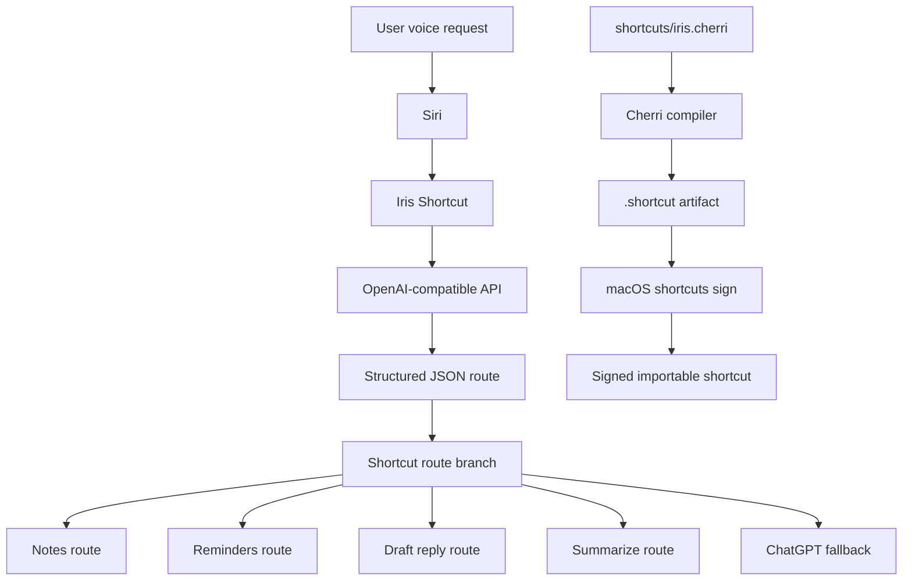

# Iris Plan

## Goal

Build an open-source, Cherri-based Apple Shortcut that approximates some of the
new Siri AI experience on older or unsupported iPhones.

The shortcut should let a user invoke Siri, start a named shortcut, describe a
productivity task, send that request to an AI planner, receive structured JSON,
and route the result into predeclared native Apple Shortcuts actions.

This is not a replacement for Apple Intelligence. It is a DIY automation layer
that uses Shortcuts as the execution engine and an AI model as the planner.

## Core User Flow

```text
User says: "Hey Siri, Iris"
        ↓
Apple Shortcuts starts Iris
        ↓
Shortcut asks what the user wants to do
        ↓
Shortcut sends request to an OpenAI-compatible API
        ↓
AI returns structured JSON
        ↓
Shortcut reads `action`
        ↓
Shortcut runs a supported native route
```

Example planner output:

```json
{
  "action": "create_reminder",
  "target": "reminders",
  "response": "Follow up with the team after the meeting.",
  "title": "Follow up with team",
  "due_date": "today"
}
```

## Why Cherri

We originally explored Python-based generation, including `shortcutpy`, but the
project is now Cherri-first.

Cherri is better suited for this project because:

- It is purpose-built for Apple Shortcuts.
- It gives us readable `.cherri` source files.
- It supports variables, conditionals, dictionaries, raw actions, and standard
  Shortcuts actions.
- It compiles directly to `.shortcut` files.
- It can be installed in CI and used as the canonical build tool.

We are not writing our own Go compiler. Cherri already handles the hard compiler
work: parsing, action lowering, Shortcut plist generation, and signing support.

## Architecture



## Current Scope

The first proof of concept should support these productivity routes:

- `summarize`: show a summary of provided text or request context.
- `draft_reply`: show a drafted reply for the user to review.
- `create_note`: create a note from the AI response.
- `create_reminder`: create a reminder from the AI title/response.
- `chatgpt_fallback`: open the ChatGPT app when native routing is not enough.

Every route must be explicitly implemented in the Shortcut. The AI cannot invent
arbitrary app actions at runtime.

## AI Planner Contract

The AI must return JSON only.

Required fields:

- `action`: one of the supported route names.
- `target`: the intended app or domain.
- `response`: human-readable result text.
- `title`: optional title for notes/reminders.
- `due_date`: optional due-date phrase for reminder/calendar routes.

The Shortcut branches on `action` and uses the other fields as inputs.

## Important Constraints

Shortcuts do not have the same private system access as Apple Intelligence.

The shortcut can work with:

- Dictated text.
- Text typed into the shortcut prompt.
- Shared text or URLs.
- Clipboard content, if the user allows it.
- Native Shortcuts actions available on the device.
- Third-party app actions only when those apps expose App Intents/Shortcuts
  actions.

The shortcut cannot automatically access everything Siri AI can access, such as
private personal context across apps, full screen awareness, or arbitrary
cross-app control.

## Build And Signing Strategy

Local source:

```text
shortcuts/iris.cherri
```

Compile:

```bash
cherri shortcuts/iris.cherri --debug --output "dist/Iris.shortcut"
```

Sign on macOS:

```bash
shortcuts sign --mode anyone \
  --input "dist/Iris.shortcut" \
  --output "dist/Iris.signed.shortcut"
```

CI should:

1. Install Go.
2. Install Cherri.
3. Compile `shortcuts/iris.cherri`.
4. On macOS, attempt `shortcuts sign`.
5. Upload generated artifacts.

The open question is whether `shortcuts sign --mode anyone` works reliably on a
fresh GitHub-hosted macOS runner without an interactive iCloud session.

## Security Rules

- Do not commit API keys.
- Do not commit personal prompts, contacts, emails, or private automation data.
- Keep examples generic.
- Make it clear that API mode sends user-provided text to the configured model
  provider.
- Prefer import-time or user-entered configuration for secrets.

## Milestones

### Milestone 1: Compile

- Keep `shortcuts/iris.cherri` compiling in CI.
- Produce an unsigned `.shortcut` artifact.

### Milestone 2: Sign

- Test GitHub Actions macOS signing.
- Document whether signing works or what fails.
- If GitHub signing fails, evaluate Depot or a temporary cloud Mac.

### Milestone 3: Device Validation

- Import the shortcut on iPhone.
- Replace the placeholder API key.
- Test summarize and draft-reply routes.
- Test note and reminder creation.

### Milestone 4: Route Expansion

- Calendar availability check.
- Email/Gmail summary or draft support where app actions allow it.
- Better reminder due-date parsing.
- Optional ChatGPT app action integration if stable identifiers are available.

## Non-Goals

- Building a native iOS app.
- Reimplementing the Cherri compiler.
- Giving AI unrestricted ability to execute arbitrary native actions.
- Claiming parity with Apple Intelligence or new Siri AI.
