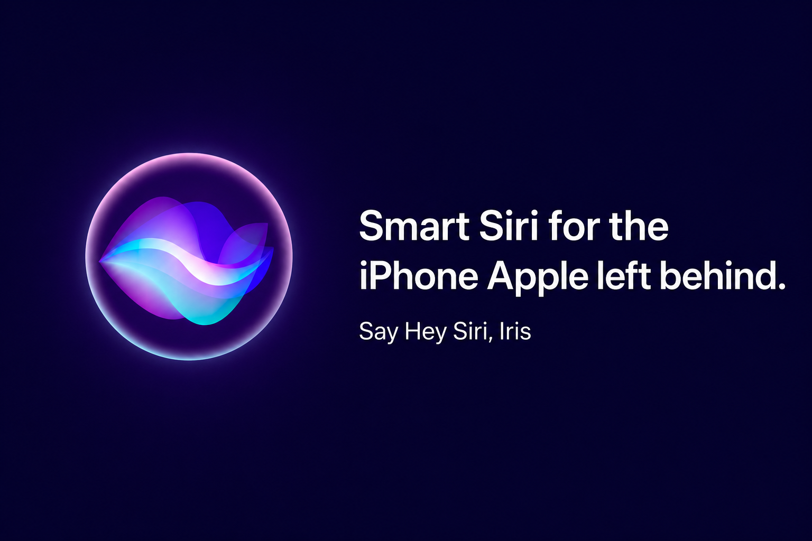

<p align="center">
  
</p>

<h1 align="center">Iris</h1>

<p align="center"><strong>Smart Siri for the iPhone Apple left behind.</strong></p>

<p align="center">
  
</p>

<p align="center">
  Say <strong>"Hey Siri, Iris"</strong> on iPhone 12, 13, or 14 — get spoken answers, set
  reminders, summarize text, and more. No Apple Intelligence. No new phone.
</p>

<p align="center">
  <a href="LICENSE"></a>
  <a href="https://www.apple.com/apple-intelligence/"></a>
  <a href="https://cherrilang.org/"></a>
</p>

## The problem

Apple Intelligence only runs on **iPhone 15 Pro and newer**. If you're on an
older iPhone, Siri still can't keep up — timers and weather, maybe, but not
real answers or useful tasks.

You shouldn't need a $1,000 upgrade to get a voice assistant that understands
you.

## What Iris does

Trigger Iris the same way you use Siri today:

- **Ask anything** — get a spoken answer (optional live web search with a free
  Tavily key).
- **Summarize** text you type, dictate, paste, or share in.
- **Draft replies** for your review — nothing is ever auto-sent.
- **Do real tasks** — reminders, notes, calendar, weather, location, maps, and
  more through native iPhone apps.

Iris does **not** use Apple's `Use Model` action or Apple Intelligence, so it
runs on older iPhones that Apple won't upgrade.

## How it works

```
You speak  →  Siri launches Iris  →  AI plans  →  iPhone apps act  →  Siri speaks back
```

1. Say **"Hey Siri, Iris"** (or run the shortcut manually).
2. Iris asks what you need and thinks with a hosted AI model (free NVIDIA NIM
   key — paste once during setup).
3. Iris runs only pre-approved native actions, then speaks and shows the
   result.

For durable context, Iris can keep a phone-local memory folder in Files
(`/Shortcuts/IrisOKF/`). See [memory docs](docs/memory-system-design.md).

**Honest limits:** Iris can't read your Mail, Messages, or screen the way new
Siri can. It works with content you provide, share in, or expose through
Shortcuts. See [supported routes](docs/routes.md).

## Get started

### On your iPhone (~10 minutes)

1. **Get the Shortcut** — download a signed build from the latest
   [GitHub Actions run](https://github.com/AffanShaikhsurab/iris/actions/workflows/build-shortcut.yml)
   (Artifacts → `Iris.signed.shortcut` or `Iris.shortcut`), or compile from
   source below.
2. **Import and add your key** — open the shortcut in the Shortcuts editor,
   paste a free `nvapi-` key into the first Text action. Full walkthrough:
   [configuration guide](docs/configuration.md).
3. **Run setup once** — say **"setup"** when prompted and tap **Always Allow**.
4. **Use it** — **"Hey Siri, Iris"** → ask for anything.

### Build from source (developers)

```bash
brew tap electrikmilk/cherri && brew install electrikmilk/cherri/cherri
mkdir -p dist
cherri shortcuts/iris.cherri --debug --output "dist/Iris.shortcut"
```

Signing, Windows/WSL, and CI details: [signing guide](docs/signing.md) ·
[build workflow](.github/workflows/build-shortcut.yml).

## Is this for you?

| | |
|---|---|
| ✅ | iPhone 12–14 (or any phone **without** Apple Intelligence) |
| ✅ | You use Siri but wish it were smarter |
| ✅ | You're okay pasting a free API key once |
| ❌ | You want zero setup |
| ❌ | You need full Apple Intelligence (screen awareness, deep app access) |

## Privacy

Your spoken and typed requests are sent to the AI provider you configure
(default: NVIDIA NIM). Web search (optional) sends queries to Tavily. Nothing
auto-sends on your behalf.

Do not store sensitive data in Iris memory — anything in a prompt goes to the
provider. Details: [security](docs/security.md) ·
[configuration](docs/configuration.md).

## For developers

Iris is an open-source [Cherri](https://cherrilang.org/) Apple Shortcut. The AI
chooses from supported routes; every native action is predeclared in source.

| Topic | Doc |
|---|---|
| Architecture | [docs/architecture.md](docs/architecture.md) |
| Agent loop & runtime | [docs/shortcut-runtime-flow.md](docs/shortcut-runtime-flow.md) |
| Route catalog | [docs/routes.md](docs/routes.md) |
| Device testing | [docs/device-testing.md](docs/device-testing.md) |
| Simulator / regression tests | `python scripts/simulate-agent.py` |
| Contributing | [CONTRIBUTING.md](CONTRIBUTING.md) |
| Roadmap | [docs/roadmap.md](docs/roadmap.md) |

**Status:** Alpha proof of concept. Manual iPhone validation is still required.
An earlier ChatGPT App Intent backend (no API key) is documented in
[notes.md](notes.md).

## License

MIT. See [LICENSE](LICENSE).
